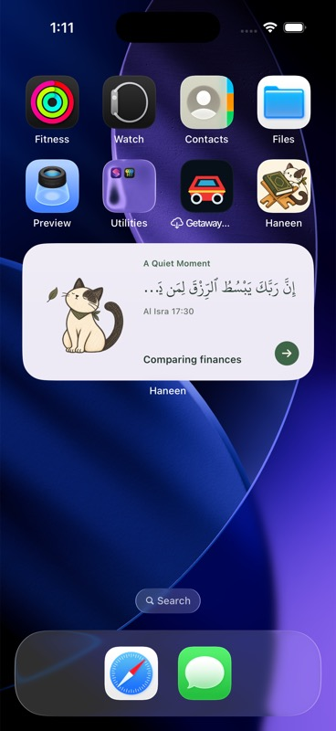

# Cream Home Screen icon, 13 September 2026

Generated with the built-in image generation tool using the previous app icon and the user's cream swatch as references.

The installed icon now uses a warm ivory background, a clearer/larger cat face, deep olive Qur’an and less saturated honey-coloured rehal. The cat stays beside the book. The existing transparent in-app mark remains the separate runtime asset.

- Generated master: `Design/HaneenBrand/AppIcon-Cream.png`
- App Store icon: `Sakina/Assets.xcassets/AppIcon.appiconset/Icon-1024.png`
- All nine catalog sizes and three legacy icon resources are rebuilt by `swift Design/HaneenBrand/package-icons.swift`.
- Source is square and opaque. Packaged PNGs omit alpha and pre-rounded corners; iOS applies the Home Screen mask.
- User's swatch was sampled as `#FCF3E3`.
- Prior sage master remains in the repository as an earlier design.

## Verification

All twelve packaged PNGs were independently checked for expected pixel sizes and no alpha. The simulator build, signed Release archive and App Store export passed. The installed icon was inspected on the simulator Home Screen in light and dark appearance and the signed build was installed on EZY. No app behaviour changed in this icon update.

## Generation prompt

Use case: logo-brand, refinement of an existing app icon. Image 1 is the current Haneen icon, the character and artistic identity to preserve. Image 2 is the user's exact desired background colour, a warm pale cream #FCF3E3. Create ONE final, beautifully balanced iOS app icon, a full square edge-to-edge opaque cream background, no pre-rounded corners. Refine the current composition so it reads superbly at 60 pixels: keep the same cream cat with charcoal-brown ears, single dark eye patch, friendly simple face, curled tail and small olive neckerchief beside an olive-green closed Qur'an elevated on a wooden X-shaped rehal. Increase the visibility of the cat's face roughly 15%, open up the silhouette slightly so cat, book and stand are each immediately recognizable. Keep the book and rehal prominent so this clearly conveys a Quran app. The cat rests BESIDE the stand and never on the Quran or its pages. Refine the huge orange stand into elegant warm honey/ochre wood with a more restrained colour; preserve the hand-drawn coloured-pencil aesthetic, crisp warm brown outlines, fewer tiny scratchy details, simple restrained gold double border and a single ornamental cover medallion. Rich deep olive book provides strong contrast against the cream background and cat. Composition occupies about 84% of the square with balanced 8% edge breathing room; cat ears, tail and stand feet safely inside iOS corner mask. Background must be flat warm cream #FCF3E3 exactly like reference 2, no gradient, texture, shadow, halo or vignette. No white panel, no outer border, no circle badge, no letters, no Arabic text, no crescent or stars, no glow, no watermark, no glossy 3D effect. Preserve the recognizable Haneen cat, not a new generic mascot. Output the actual square icon artwork, not an icon on a phone mockup.
