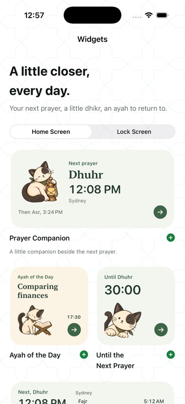

# Haneen widgets, 13 September 2026

Recomposed Home Screen widgets around larger pencil cats, clear prayer timing,
compact daily ayah references and direct links into the relevant content.
Cream, sage and lavender surfaces adapt to dark mode. All ten widget kinds and
existing installed-widget identifiers remain available. The chooser previews
supported Small, Medium and Lock Screen sizes using the production card views.

Morning/evening completion comes only from finishing that collection in the
reader. Opening a collection, saving a reading place or ticking a goal does not
count. Completion is scoped to the local Gregorian day and shared through the
App Group. No streak, score or reminder pressure was introduced. These changes
are intended to make return visits useful; increased retention has not been measured.

Daily timelines supply future midnight entries. Prayer timelines include solar
instants and explicit expiry states. The quiet-moment link targets the displayed
ayah even if tapped after midnight. Widgets follow the app's chosen language.

## New artwork

Created with the built-in image generation tool using Haneen's existing morning
cat and lantern cat as style/character references. Final original PNGs are stored
in these asset sets:

- `Shared/CompanionAssets.xcassets/Companion-widgetMorning.imageset/artwork.png`
- `Shared/CompanionAssets.xcassets/Companion-widgetEvening.imageset/artwork.png`
- `Shared/CompanionAssets.xcassets/Companion-widgetReading.imageset/artwork.png`

The masters are retained at generated resolution. The existing native cutout
renderer removes edge-connected white paper at runtime; widget illustrations
are downsampled to at most 420 pixels before processing and cached with a memory
limit. No generated Qur'an or hadith text is used as app content.

### Prompt set

Shared prompt: Create one polished colored-pencil illustration for Haneen's iOS
widget, matching the reference cream cat with charcoal ears and eye patch, olive
neckerchief, simple friendly face, warm graphite outlines and restrained pencil
texture. Crisp silhouette legible at 90 pixels; large expressive head; warm light
cream fur. Transparent background, no words, UI, border, ornaments, glow or
watermark; square composition with 4% breathing room.

Morning: Cat peeking diagonally up from the lower-left corner with a large head,
two soft front paws leaning across the lower edge, part of shoulder and curling
tail visible, calm curious welcoming expression. Keep ears and paws intact.

Evening: Compact seated cat curled around a small warm brass lantern at its
right, large tilted head and relaxed eyes. Cat dominates about 80% of the
composition. Warm gold lantern window without emitted glow.

Reading: Cat seated attentively beside an open Qur'an on an olive-brown wooden
X-shaped rehal, large face at left and stand at lower right, tail curved around
the composition. Cat does not sit, stand or paw on the pages. Abstract short
pencil lines only on the pages, no invented readable Arabic.

Final background edit applied to each: Keep the illustration unchanged. Replace
all black/checkerboard background around the subject with solid pure white
#FFFFFF for the app's existing image loader. No shadow, gray paper texture,
gradient, border or new details; crisp subject edges.

## Verification

68 iOS tests passed on the final code, including the seven new completion and
artwork tests. Debug and signed Release archive builds passed, and App Store
export succeeded. The signed app was installed on EZY.

Simulator checks covered English and Arabic, light and dark card surfaces,
170-point and narrower 158-point Home Screen widgets, the chooser and add
instructions, and collection/prayer deep links. Morning page 14 and evening
page 2 now restore independently when switching through the widget routes.
Compact titles cover all 84 catalog situations in both languages.

The gallery uses actual production SwiftUI card layouts with labelled sample
times/completion. It does not simulate WidgetKit refresh budget, Home Screen
placement or real device power conditions. App Store upload remains separate.

Apple references consulted:
- https://developer.apple.com/design/human-interface-guidelines/widgets
- https://developer.apple.com/documentation/widgetkit/keeping-a-widget-up-to-date/
- https://developer.apple.com/documentation/widgetkit/optimizing-your-widget-for-accented-rendering-mode-and-liquid-glass
